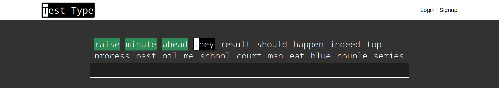
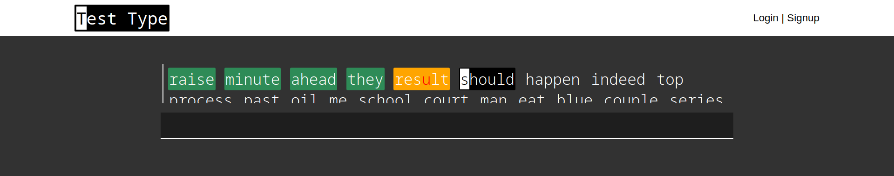
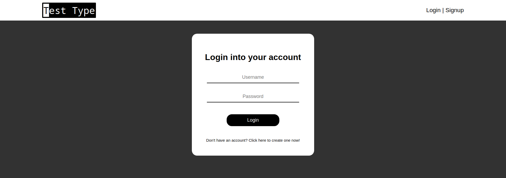
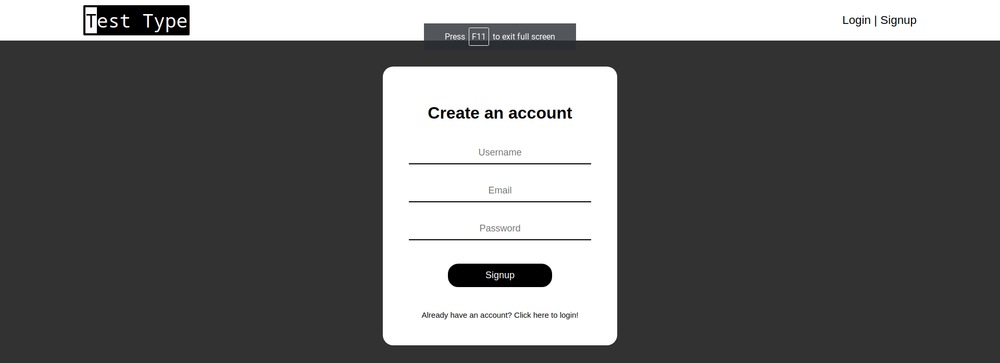
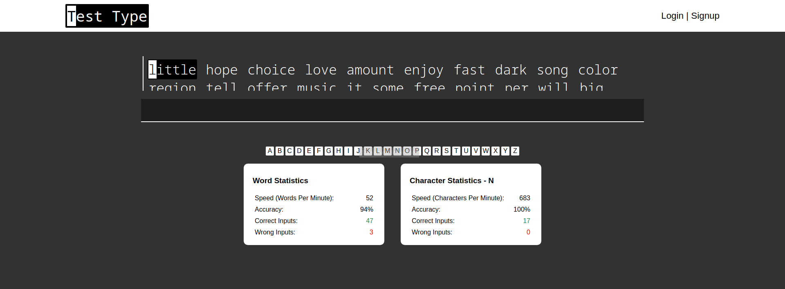
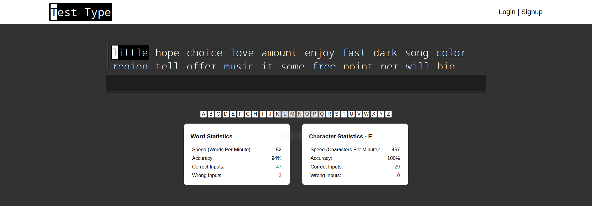

**Note: This project is no longer maintained**

# Motivation

The motivation for this project came from a number of typing websites including Keybr and 10FastFingers. 
I wanted to bump my typing speed by focusing on weak characters like in Keybr but the idea of typing combinations of random letters didn't resonate much with me. 
So I created a small project, a hybrid between typing actual words and focusing on weak characters. The scale of this project was quite larger than the scale of my previous projects. 
Although this project is far from ready when compared to the typing products out there, it holds a special value in my heart.

# Tech Stack
- Python3
- Flask 
- Typescript
- Mariadb / MySQL

# Build Steps
1. Create a new virtual environment in a folder called 'venv' for this project:
```bash
python3 -m venv venv
``` 

2. Activate the virtual environment:
```bash
source venv/bin/activate
``` 

3. Install the required packages:
```bash
pip install -r requirements.txt
``` 

4. Add words to the database (One-time setup):
```bash
python3 main.py --add-words
```

5. Launch the server
```bash
python3 main.py
```

# Screenshots
## Normal


## Error


## Account Management
Signing in to your account\


Signing up for your account\


## Typing Statistics

